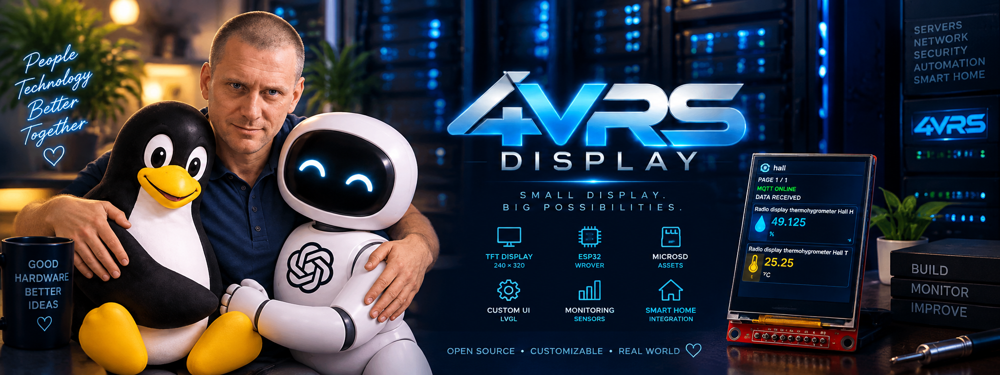
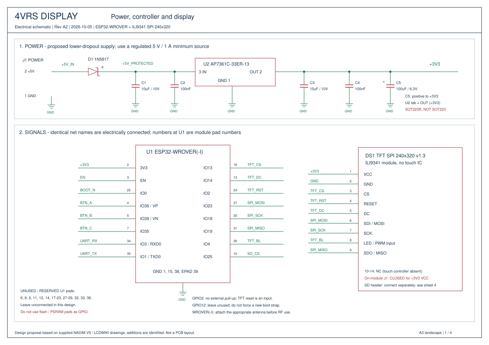
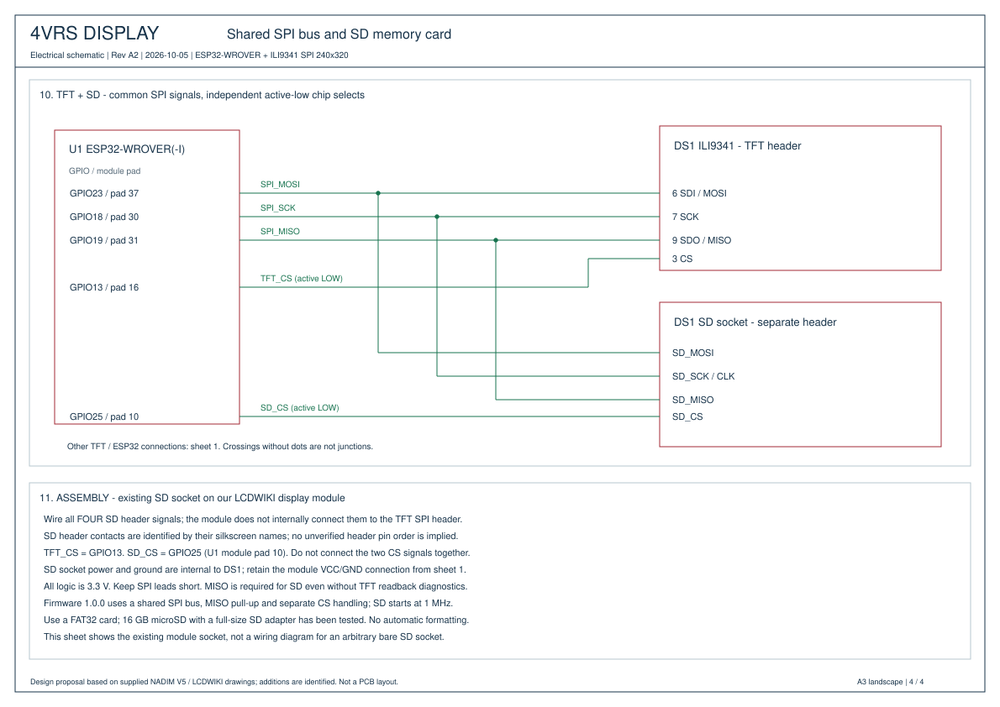
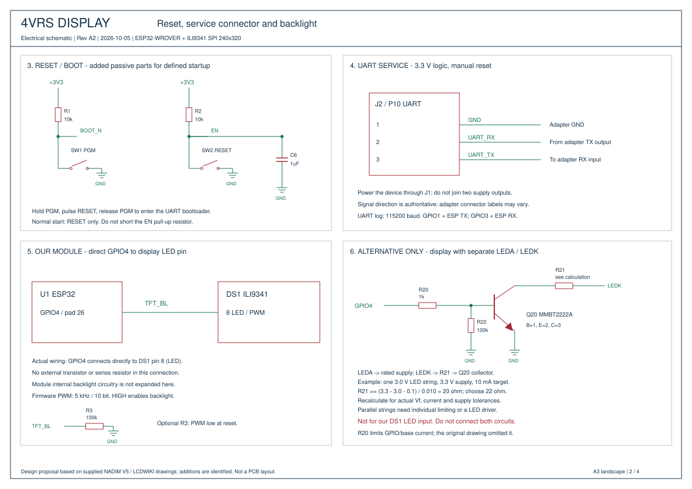
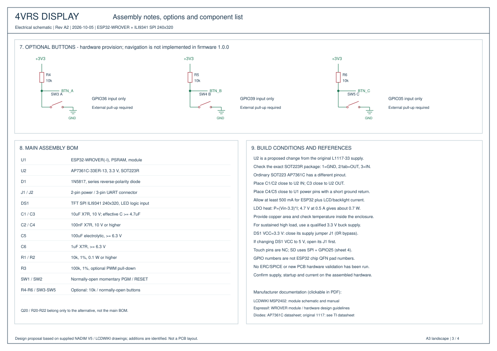

**English** | [Русский](README.ru.md)



# 4VRS Display

**Small display. Big possibilities.**

4VRS Display is an open-source ESP32 telemetry display and standalone photo frame. It brings room temperatures, humidity, lighting, ventilation, water-leak alerts and other entity states to a compact screen wherever you need them: a living room, garage or server room.

Choose the entities in Home Assistant; the integration sends their states through MQTT, and the display groups them by room. Configure the device in your browser and update its firmware over Wi-Fi without removing it from its installation.

**Stable firmware: 1.0.0 · Home Assistant integration: 0.4.3 · License: MIT**

[Download the release](https://github.com/dk-1983/4VRS-Display/releases/tag/firmware-v1.0.0) · [Report an issue](https://github.com/dk-1983/4VRS-Display/issues)

[Hardware](#supported-hardware) · [Schematic](#electrical-schematic) · [First setup](#first-setup) · [Home Assistant](#home-assistant-integration) · [Media](#photo-frame-and-animations) · [Updates](#firmware-updates)

## Features

- **Up to 20 entities per display**, selected and edited in Home Assistant.
- **Room-by-room presentation**: a full-screen room title and icon, followed by pages of up to three cards. Different rooms never share a page.
- **Meaningful icons and states** for temperature, humidity, lights, fans, valves, leak sensors and other equipment, with a text fallback for unrecognized types.
- **Data freshness indicators** that distinguish unavailable, unknown and stale data from an inactive device.
- **Local web configuration** for Wi-Fi, MQTT, language, credentials and updates, with an About page for device information.
- **English by default and Russian as an option** in the web interface.
- **Standalone photo frame and GIF player** with browser uploads, previews, deletion and per-file slideshow settings on FAT32 SD.
- **A built-in fallback artwork** for devices without user media; demonstrations are skipped when custom media exists.
- **Brightness control from web and HA**, 50% initial default, a dark startup and smooth fade after the first image.
- **Wi-Fi switching with rollback**, optional static IPv4 and editable device names.
- **LAN ArduinoOTA and signed GitHub updates**, with two application slots, boot validation and rollback support.
- **Per-device automatic-update controls** in the web interface and Home Assistant integration.

The current release displays entity states; operating physical equipment from the display is not implemented.

## How it works

```text
Home Assistant → MQTT broker → 4VRS Display
Browser        → local web interface → device settings
GitHub release → signed update feed → firmware update
```

Each display has its own identity, pairing key and entity selection. Room membership comes from the entity's area, then its device's area; entities without an area form a separate group.

For example, a room with five entities shows its cover, then pages of **3 + 2** cards. A second room with four entities shows its own cover, then **3 + 1**. The sequence repeats automatically. Room covers last three seconds and card pages eight seconds. Covers can be disabled and are automatically skipped for a single room.

The integration sends snapshots when states change and every 30 seconds. After 90 seconds without a fresh snapshot, the display marks the data as stale.

## Supported hardware

The current firmware targets **ESP32-WROVER with 4 MiB PSRAM**, the **NADIM V5** baseboard and a **240 × 320 SPI ILI9341** display in portrait orientation. This is a specific hardware profile; other ESP32 boards and displays may require changes.

| Display signal | ESP32 GPIO |
| --- | --- |
| CS | 13 |
| DC / A0 | 14 |
| RESET | 2 |
| MOSI / SDA | 23 |
| SCK | 18 |
| SDO / MISO, optional diagnostics | 19 |
| LED / PWM, module pin 8 | 4 |

The display is a factory-built module: our schematic shows its external connections. GPIO4 connects directly to module pin 8 (LED), without an external transistor. GPIO signals use 3.3 V logic; follow the module's power specifications. A touchscreen is not required. An SD card is needed for user photos and GIFs; the built-in artwork is available without one.

### SD card connection

| SD connector signal | ESP32 GPIO |
| --- | --- |
| SD_MOSI / MOSI | 23 |
| SD_MISO / MISO | 19 |
| SD_SCK / CLK | 18 |
| SD_CS / CS | 25 |

The SD socket on the display module has a **separate connector**: wire all four signals explicitly; they are not connected to the TFT header internally. TFT and SD share MOSI, MISO and SCK, but use separate CS lines (TFT: GPIO13, SD: GPIO25). The socket receives power through the display module. User media requires a FAT32 card; 16 GB microSD cards in full-size SD adapters have been tested. MISO is required for SD even if TFT diagnostics are not used.

## Electrical schematic

[Open the complete four-sheet A3 PDF](hardware/schematic/4vrs-display-schematic-A2.pdf) · [Assembly notes and editable drawings](hardware/schematic/README.md)

Power, ESP32 and TFT connections are shown below, followed by the shared SPI bus and the separate **SD_CS → GPIO25** connection. The extended supply circuit is optional; the original working L1117-33 circuit remains supported.





<details>
<summary>Reset, UART, backlight and optional buttons</summary>





</details>

## Manufacturer documentation

- [LCDWIKI: 2.4-inch SPI ILI9341 module](https://www.lcdwiki.com/2.4inch_SPI_Module_ILI9341_SKU:MSP2402) — module schematic, user manual and mechanical drawings.
- [Espressif documentation catalogue](https://www.espressif.com/en/support/documents/technical-documents) — select the datasheet matching the exact module marking.
- [ESP32-WROVER-E / WROVER-IE datasheet](https://documentation.espressif.com/esp32-wrover-e_esp32-wrover-ie_datasheet_en.html) and [ESP32 hardware design guidelines](https://docs.espressif.com/projects/esp-hardware-design-guidelines/en/latest/esp32/schematic-checklist.html).
- [ESP LINK v1.0 documentation from IOT-MCU](https://github.com/IOT-MCU/ESP-LINK-v1.0) — an example USB-UART adapter, not a required model. Its ESP-01 instructions are not the ESP32 flashing procedure.
- [Base circuit and optional extended schematic (A2), BOM and assembly notes](hardware/schematic/README.md).

## First setup

1. Download `4vrs-display-1.0.0-factory.bin` from the release. For the initial UART installation, select **ESP32** in the Espressif flashing tool and write the factory image at **0x0**. This replaces data in the image's flash region; use OTA for an already configured device.
2. Enter the board's bootloader mode, flash the image, wait for verification, then reset normally without holding BOOT/PGM.
3. Connect to the setup Wi-Fi network `4vrs-rack-<id>-setup`. Its password is **`KIaE18TTn4Omp8H-0peXAk1i`**.
4. Open **http://192.168.4.1/**, select your **2.4 GHz Wi-Fi** network and enter its password.
5. Find the device's assigned IP in your router's DHCP client list and open it in a browser. A DHCP reservation keeps its address consistent. The setup access point turns off after a stable LAN connection.
6. Sign in with **username `admin`, password `admin`**. Change these in **Settings**, where you can also select the interface language. Web, Wi-Fi and ArduinoOTA credentials are separate.
7. **For Home Assistant telemetry:** open **MQTT** and enter your broker's host without `http://`, port, username and password. Use the same broker as Home Assistant.

Without telemetry entities, the display uses selected media or the built-in fallback. MQTT is optional for standalone media use.

## Display and network preferences

- **Settings → Show room covers** turns the room title/icon screens on or off. It defaults to on and survives reboot and OTA. Turning it off keeps the room name in each page header and never mixes rooms.
- **About → Check display** reads controller registers and explains the result. Connect SDO/MISO to GPIO19 for readback; this checks communication, not the LCD glass or backlight.
- **IPv4 settings** selects DHCP (default) or a static IP, subnet mask, gateway and two DNS servers. Gateway/DNS may be empty for an isolated LAN; GitHub updates require internet access and DNS. Use an unused address outside the dynamic pool or reserve it in your router. The setup AP subnet 192.168.4.0/24 is reserved.
- Address changes are tried for three minutes. Open `/network` at the new LAN address and click **Confirm connection** to save. Without confirmation, or after a power cycle before confirmation, the previous settings return. Setup Wi-Fi remains available during the trial; firmware updates are paused until it ends. Configure Wi-Fi first when setting up a new board.

## Home Assistant integration

Firmware **1.0.0** bundles Home Assistant integration **0.4.3**. The two components are versioned independently; `fourvrs_display-0.4.3.zip` is the correct integration archive for this release.

1. Configure Home Assistant's MQTT integration.
2. Download `fourvrs_display-0.4.3.zip` from the release and copy its `custom_components/fourvrs_display` directory into your HA configuration's `custom_components` directory.
3. Restart Home Assistant and add the **4VRS Display** integration.
4. Enter the **Device ID** and **pairing key** shown on this display's authenticated MQTT configuration page.
5. Select **0–20 different entities** and save. Their states and room information will be sent to the display.

To edit the selection later, open **Settings → Devices & services → Integrations → 4VRS Display** and use the integration entry's **gear icon**. You do not need to delete and recreate the connection. The pencil on the device page edits device metadata, not the displayed entity list.

`connected: true` confirms a broker connection. If `has_snapshot: false` remains, check pairing, the selected entities and that HA and the display use the same broker.

## Photo frame and animations

Open **Settings → Multimedia → Media library**. Upload JPEG, PNG or BMP photos, or GIF animations. Photos are converted in your browser to 240×320 BMP with preserved proportions and black margins. GIFs remain unchanged: **maximum 240×320 and 256 KiB per file**. A FAT32 SD card is required for user media; 16 GB cards have been tested.

Enable **Slideshow** and select the files to include. Each file has its own duration (1–3600 seconds); GIF speed is adjustable from 25–400%. Settings survive restart and OTA. The display's 1 MHz SPI transfer limits actual frame rate: small animated regions work best. Disable **Show telemetry** to keep receiving MQTT while viewing media. No selected HA entities also permits media mode.

Wire the display module's **separate SD connector**: MOSI→23, MISO→19, CLK→18, CS→25. These pins are not internally connected to the TFT header. The firmware creates media folders and never formats the card. The library lists up to 64 files; photos are stored under `/4vrs/photos/`, GIFs under `/4vrs/animations/`. Existing filenames are not overwritten. The built-in portrait and original demo are fallback assets, not ordinary playlist content when user files exist.

Video/audio playback, media upload from HA, local sensors, and physical-button navigation are not implemented. File timing and slideshow are controlled from the device web interface. Decorative sample animations do not represent live device readings.

## Firmware updates

Use the **application image** `4vrs-display-1.0.0.bin` for OTA; the factory image is for initial UART installation. ArduinoOTA remains available on the local network, with an individual password configurable in **Settings → ArduinoOTA**.

GitHub updates use a signed stable manifest. Before installation, the firmware checks the signature, hardware profile, version, image size and SHA-256 digest. It writes to the inactive application slot and validates the next boot, with rollback support for failed startup.

Automatic updates are enabled by default and can be blocked for an individual display through the web interface or Home Assistant. Either block prevents automatic installation. Once HA manages the update policy, fresh permission from HA is required. A new source commit alone does not trigger installation: an update must be published through the signed stable feed.

- During firmware installation the TFT shows progress, followed by verification/restart. The first upgrade from an older firmware gains this screen only for subsequent updates.

## Development and documentation

| Directory | Purpose |
| --- | --- |
| `firmware/rack_bootstrap/` | ESP32 firmware and embedded web interface |
| `home_assistant/custom_components/fourvrs_display/` | Home Assistant integration |
| `protocol/` | Shared MQTT contract, JSON schemas and examples |
| `tools/` | Build, OTA and release tools |
| `assets/` | Images and project artwork |
| `docs/` | User and development guides |

The build uses Arduino CLI, Arduino-ESP32 **3.3.8**, Adafruit GFX, Adafruit ILI9341 and AnimatedGIF **2.2.0** with their dependencies. Supply your Arduino CLI configuration file:

```sh
python tools/build.py --config <arduino-cli.yaml> --version 1.0.0
```

Run the integration and release checks:

```sh
python -m unittest discover -s home_assistant/tests -v
python -m pip install -r tools/requirements-release.txt
python tools/test_release.py
```

Detailed guides (some currently in Russian): [first setup](docs/user-guide.md), [hardware](docs/hardware.md), [Home Assistant](docs/home-assistant.md), [updates](docs/updates.md), [development](docs/development.md) and [roadmap](docs/plan.md). The full Russian version of this overview is available through the language link at the top.

Bug reports and contributions are welcome. Include component versions, hardware details and steps to reproduce; remove passwords and pairing keys from logs before sharing them.

## License

Original project code and documentation are distributed under the [MIT License](LICENSE). Third-party libraries retain their own licenses. Third-party branding in optional sample artwork remains the property of its owners and is not covered by a trademark grant under MIT.
