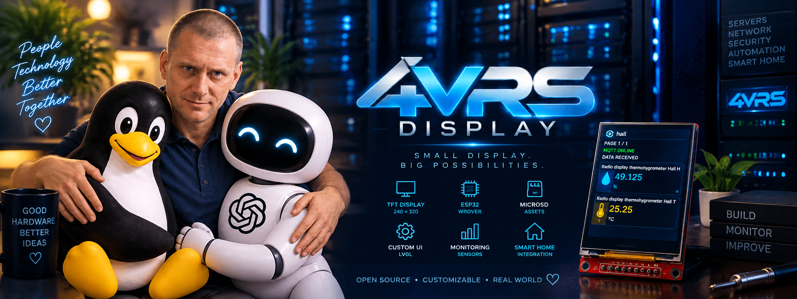

[English](README.md) | **Русский**



# 4VRS Display

**Маленький дисплей. Большие возможности.**

4VRS Display — открытый проект дисплея на ESP32 для Home Assistant. Температура, влажность, освещение, вентиляция, протечки и другие состояния сущностей отображаются на небольшом экране там, где нужны: в комнате, гараже или серверной.

Вы выбираете сущности в Home Assistant, интеграция передаёт их состояния через MQTT, а дисплей группирует карточки по помещениям. Настройка доступна из браузера, обновление прошивки — по Wi-Fi без снятия установленного прибора.

**Стабильная прошивка: 0.4.3 · Интеграция Home Assistant: 0.4.0 · Лицензия: MIT**

[Скачать релиз](https://github.com/dk-1983/4VRS-Display/releases/tag/firmware-v0.4.3) · [Сообщить об ошибке](https://github.com/dk-1983/4VRS-Display/issues)

## Возможности

- **До 20 сущностей на дисплей**, с выбором и редактированием в Home Assistant.
- **Показ по помещениям**: полноэкранная заставка с названием и значком, затем страницы максимум по три карточки. Разные помещения не смешиваются на одной странице.
- **Понятные значки и состояния** температуры, влажности, света, вентиляторов, клапанов, датчиков протечки и другого оборудования; для неизвестных типов предусмотрено текстовое отображение.
- **Контроль актуальности данных**: недоступные, неизвестные и устаревшие состояния отличаются от выключенного оборудования.
- **Локальная web-настройка** Wi-Fi, MQTT, языка, реквизитов и обновлений; информация о приборе собрана в разделе About.
- **Английский по умолчанию и русский по выбору** в web-интерфейсе.
- **Встроенная статичная заставка**, сохранённая в прошивке и работающая без карты памяти.
- **ArduinoOTA по локальной сети и подписанные обновления с GitHub**, два раздела приложения, проверка запуска и поддержка отката.
- **Индивидуальная блокировка автообновлений** через web и интеграцию Home Assistant.

Текущий релиз показывает состояния сущностей; управление физическим оборудованием с экрана пока не реализовано.

## Как это работает

```text
Home Assistant → MQTT-брокер → 4VRS Display
Браузер        → локальный web-интерфейс → настройки прибора
Релиз GitHub   → подписанный канал обновлений → обновление прошивки
```

У каждого дисплея собственный идентификатор, ключ сопряжения и список сущностей. Помещение определяется сначала по сущности, затем по её устройству; сущности без помещения образуют отдельную группу.

Например, для комнаты с пятью сущностями показываются заставка и страницы **3 + 2**. Для следующей комнаты с четырьмя сущностями — её заставка и страницы **3 + 1**. Последовательность автоматически повторяется. Заставка комнаты отображается три секунды, страница карточек — восемь секунд.

Интеграция отправляет снимки данных при изменении состояний и каждые 30 секунд. Через 90 секунд без свежего снимка дисплей помечает данные устаревшими.

## Поддерживаемое оборудование

Текущая прошивка рассчитана на **ESP32-WROVER с 4 MiB PSRAM**, базовую плату **NADIM V5** и **SPI-дисплей ILI9341 240 × 320** в вертикальной ориентации. Это конкретный аппаратный профиль; другие платы ESP32 и дисплеи могут потребовать изменений.

| Сигнал дисплея | GPIO ESP32 |
| --- | --- |
| CS | 13 |
| DC / A0 | 14 |
| RESET | 2 |
| MOSI / SDA | 23 |
| SCK | 18 |
| SDO / MISO, необязательная диагностика | 19 |
| Вход LED (транзистор установлен на модуле) | 4 |

Тачскрин и microSD для работы не нужны. Уровень сигналов GPIO — 3,3 В; питание модуля дисплея подключается согласно его документации, GPIO4 подключается к входу LED, управляющему транзистором на самом модуле.

## Документация производителей

- [LCDWIKI: модуль SPI ILI9341 2,4 дюйма](https://www.lcdwiki.com/2.4inch_SPI_Module_ILI9341_SKU:MSP2402) — электрическая схема, руководство и габаритные чертежи.
- [Каталог документации Espressif](https://www.espressif.com/en/support/documents/technical-documents) — datasheet нужно выбирать по точной маркировке модуля.
- [Datasheet ESP32-WROVER-E / WROVER-IE](https://documentation.espressif.com/esp32-wrover-e_esp32-wrover-ie_datasheet_en.html) и [рекомендации Espressif по схемотехнике ESP32](https://docs.espressif.com/projects/esp-hardware-design-guidelines/en/latest/esp32/schematic-checklist.html).
- [Документация ESP LINK v1.0 от IOT-MCU](https://github.com/IOT-MCU/ESP-LINK-v1.0) — пример USB-UART адаптера, а не обязательная модель. Инструкции для ESP-01 из его руководства не заменяют порядок прошивки ESP32.
- [Наша электрическая схема, перечень деталей и пояснения](hardware/schematic/README.ru.md).

## Первый запуск

1. Скачайте `4vrs-display-0.4.3-factory.bin` из релиза. Для первоначальной прошивки по UART выберите **ESP32** в утилите Espressif и запишите factory-образ по адресу **0x0**. Он заменяет данные в занимаемой области flash; настроенный прибор обновляйте через OTA.
2. Включите загрузчик платы, запишите образ, дождитесь проверки и выполните обычный RESET без удержания BOOT/PGM.
3. Подключитесь к сети настройки `4vrs-rack-<id>-setup`. Пароль: **`KIaE18TTn4Omp8H-0peXAk1i`**.
4. Откройте **http://192.168.4.1/**, выберите свою сеть **Wi-Fi 2,4 ГГц** и введите её пароль.
5. Найдите выданный прибору IP в списке DHCP-клиентов роутера и откройте его в браузере. Резервирование DHCP позволит сохранить постоянный адрес. После стабильного подключения к локальной сети точка настройки выключается.
6. Войдите с **логином `admin` и паролем `admin`**. Изменить их и выбрать язык можно в **Settings**. Реквизиты web, Wi-Fi и ArduinoOTA независимы.
7. Откройте **MQTT**, укажите адрес брокера без `http://`, порт, пользователя и пароль. Брокер должен быть тем же, который использует Home Assistant.

При отключённом MQTT отображается встроенная заставка.

## Интеграция Home Assistant

1. Настройте штатную интеграцию MQTT в Home Assistant.
2. Скачайте `fourvrs_display-0.4.0.zip` из релиза и скопируйте каталог `custom_components/fourvrs_display` в каталог `custom_components` конфигурации HA.
3. Перезапустите Home Assistant и добавьте интеграцию **4VRS Display**.
4. Укажите **Device ID** и **pairing key** с защищённой страницы настройки MQTT именно этого дисплея.
5. Выберите **от 1 до 20 различных сущностей** и сохраните. Их состояния и сведения о помещениях будут передаваться на дисплей.

Для изменения списка откройте **Настройки → Устройства и службы → Интеграции → 4VRS Display** и нажмите **шестерёнку записи интеграции**. Удалять и создавать подключение заново не нужно. Карандаш на странице устройства изменяет его метаданные, а не список выводимых сущностей.

`connected: true` подтверждает соединение с брокером. Если остаётся `has_snapshot: false`, проверьте сопряжение, выбранные сущности и использование одного брокера в HA и на дисплее.

## Обновление прошивки

Для OTA используется **образ приложения** `4vrs-display-0.4.3.bin`; factory-образ предназначен для первой установки по UART. ArduinoOTA остаётся доступной в локальной сети, индивидуальный пароль задаётся в **Settings → ArduinoOTA**.

Обновления с GitHub используют подписанный манифест стабильного канала. Перед установкой прошивка проверяет подпись, аппаратный профиль, версию, размер образа и SHA-256. Запись выполняется в неактивный раздел приложения; следующий запуск проверяется, предусмотрен откат при неудачном старте.

Автообновления включены по умолчанию и могут быть заблокированы отдельно для каждого прибора через web или Home Assistant. Любая из блокировок запрещает автоматическую установку. Когда политикой обновлений управляет HA, требуется актуальное разрешение от HA. Новый коммит исходников сам по себе не запускает установку: обновление должно быть опубликовано в подписанном стабильном канале.

## Планы развития

Следующие этапы — GIF и анимации 4VRS, пользовательские медиа на microSD, загрузка через web, самостоятельный режим фоторамки, локальные датчики и навигация тремя физическими кнопками. Это планы, а не функции текущего релиза. Встроенное изображение останется резервной заставкой, если пользовательские медиа недоступны.

## Разработка и документация

| Каталог | Назначение |
| --- | --- |
| `firmware/rack_bootstrap/` | Прошивка ESP32 и встроенный web-интерфейс |
| `home_assistant/custom_components/fourvrs_display/` | Интеграция Home Assistant |
| `protocol/` | Общий контракт MQTT, JSON-схемы и примеры |
| `tools/` | Сборка, OTA и подготовка релизов |
| `assets/` | Изображения и оформление проекта |
| `docs/` | Руководства пользователя и разработчика |

Для сборки используются Arduino CLI, Arduino-ESP32 **3.3.8**, Adafruit GFX и Adafruit ILI9341 с зависимостями. Укажите свой файл конфигурации Arduino CLI:

```sh
python tools/build.py --config <arduino-cli.yaml> --version 0.4.3
```

Проверки интеграции и выпуска:

```sh
python -m unittest discover -s home_assistant/tests -v
python -m pip install -r tools/requirements-release.txt
python tools/test_release.py
```

Подробные руководства: [первый запуск](docs/user-guide.md), [оборудование](docs/hardware.md), [Home Assistant](docs/home-assistant.md), [обновления](docs/updates.md), [разработка](docs/development.md) и [план развития](docs/plan.md). Полная английская версия этого описания доступна по ссылке выбора языка вверху.

Сообщения об ошибках и вклад в разработку приветствуются. Указывайте версии компонентов, оборудование и шаги воспроизведения; перед публикацией журналов удаляйте пароли и ключи сопряжения.

## Лицензия

Собственный код и документация проекта распространяются по [лицензии MIT](LICENSE). Сторонние библиотеки сохраняют свои лицензии.
