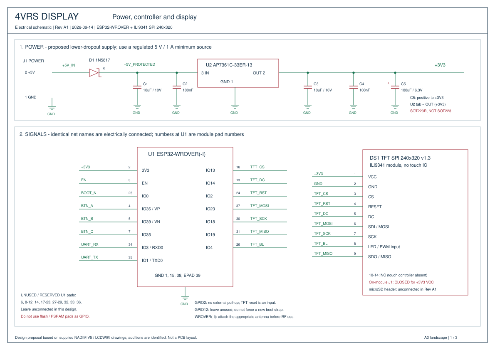

[English](README.md) | **Русский**

# Электрическая схема 4VRS Display - редакция A1

## Базовый и расширенный варианты

**Базовый вариант:** исходная схема автора, по которой собраны и работают устройства. В ней сохраняются исходное питание на L1117-33 и состав компонентов, с подключением нашего ILI9341 и прямым соединением GPIO4 с управляющим входом LED.

**Расширенный вариант (A1):** PDF, SVG, перечень деталей и список соединений ниже описывают необязательную альтернативу с AP7361C и дополнительными компонентами питания и запуска. Автор проверил и одобрил схемотехнические решения. Это не перечень установленных деталей существующих плат и не обязательная модернизация.

Базовая схема остаётся основной реализацией проекта. Усложнение A1 необязательно; сравнительных измерений, подтверждающих его выигрыш в стабильности для этой установки, не проводилось. Переделывать работающие платы под A1 не требуется. Три кнопки оставлены на перспективу развития прошивки.

[Скачать PDF: три листа A3](4vrs-display-schematic-A1.pdf)

## Состав

- [Лист 1: питание, контроллер и дисплей](4vrs-display-schematic-A1-sheet-1.svg)
- [Лист 2: сброс, UART и подсветка](4vrs-display-schematic-A1-sheet-2.svg)
- [Лист 3: кнопки, детали и примечания](4vrs-display-schematic-A1-sheet-3.svg)
- [Перечень деталей](bom.csv), [список соединений](connections.json), [исходник чертежа](generate_schematic.py).

Схема составлена по предоставленным фрагментам NADIM V5 и документации LCDWIKI. Проверенная распиновка дисплея сохранена. Изменённый стабилизатор и дополнительные пассивные компоненты — предложения этой редакции, а не утверждение об их наличии на уже собранных платах. SVG — редактируемые векторные чертежи; это не проект KiCad и не разводка печатной платы.

## Основное подключение дисплея

CS=GPIO13, DC=GPIO14, RESET=GPIO2, MOSI=GPIO23, SCK=GPIO18, MISO=GPIO19, LED=GPIO4. Назначения совпадают с прошивкой 0.4.3. Земля общая. Номера выводов на символе соответствуют модулю, а не кристаллу ESP32.

По схеме LCDWIKI на модуле уже стоят транзистор S8050 и резистор базы 1 кОм. Поэтому GPIO4 подключается напрямую к управляющему входу LED. Внешний NPN показан только как вариант для другого дисплея с отдельными LEDA/LEDK; одновременно с основной схемой он не устанавливается. Расчёт сопротивления приведён для конкретного примера одной цепочки светодиодов и не является универсальным номиналом.

На чертеже дисплей питается от 3,3 В, его джампер J1 замкнут. При питании модуля от 5 В J1 должен быть разомкнут. Перед изменением джампера нужно сверить фактическую ревизию модуля. Контакты тачскрина и разъём microSD оставлены неподключёнными; подключение SD не входит в эту редакцию.

## Питание и запуск

В A1 предложен AP7361C-33ER-13 в **SOT223R**: 1=GND, 2/теплоотвод=OUT, 3=IN. Обычный AP7361C в SOT223 имеет другую распиновку. Этот вариант заменяет исходный L1117-33 и уменьшает требуемый запас напряжения после последовательного диода. Это не указание перепаивать стабилизатор на рабочей плате без проверки корпуса и разводки.

Если оставить LM1117, нужно проверить по документации именно его производителя выходной конденсатор, ESR и падение напряжения при реальном токе. Входные 100 нФ исходного фрагмента сами по себе не заменяют добавленную на чертеже накопительную ёмкость.

Источник 5 В / 1 А — исходное требование, а не гарантия достаточного охлаждения LDO. На ESP32 нужно предусмотреть не менее 500 мА плюс ток дисплея. Проверьте питание при передаче Wi-Fi и рассчитайте нагрев при реальной средней нагрузке; нужны теплоотводящая медь либо подходящий импульсный преобразователь при длительном большом токе. При входе 4,7 В и токе 0,5 А на LDO выделяется около 0,7 Вт.

Для EN добавлены подтяжка 10 кОм и конденсатор 1 мкФ. BOOT замыкает GPIO0 на землю, RESET — EN на землю. На GPIO2, используемом для сброса TFT, внешняя подтяжка вверх не добавляется; состояние загрузочного вывода GPIO12 не меняется. Выводы внутренней flash/PSRAM зарезервированы.

Три необязательные кнопки подключены к GPIO36, GPIO39 и GPIO35 с внешними подтяжками 10 кОм, согласно исходным BTN_A/B/C. Обработка меню этими кнопками в текущей прошивке ещё не реализована.

## Универсальное подключение UART

| J2 / исходный P10 | Сигнал ESP32 | Направление со стороны USB-UART |
| --- | --- | --- |
| 1 GND | Общая земля | GND |
| 2 RX | Вход GPIO3 / U0RXD | Выход TX адаптера |
| 3 TX | Выход GPIO1 / U0TXD | Вход RX адаптера |

Нужен USB-UART с **логикой 3,3 В**. ESP LINK v1.0 приведён только как пример использованной модели, подойдут и другие адаптеры. На разъёмах программаторов маркировка бывает дана со стороны целевого устройства, поэтому соединение по надписям RX/RX и TX/TX может соответствовать правильным электрическим направлениям. Ориентируйтесь на документацию адаптера; проверенное подключение не нужно менять вслепую.

Плата питается через J1; от адаптера подключаются земля и два сигнала UART. Второй источник питания нельзя объединять с уже запитанной шиной 3,3 В. В этой схеме BOOT и RESET переключаются вручную. Колодка ESP-01 и автоматическое управление сбросом конкретного программатора не требуются.

## Что проверено

Сопоставлены GPIO прошивки и документация; список соединений учитывает все 39 площадок модуля и проверяет отсутствие назначения одного вывода разным цепям. Все три листа PDF отрисованы и визуально проверены. Проверка KiCad ERC, моделирование SPICE, проверка разводки PCB и аппаратное испытание предложенного питания не проводились. На собранной плате остаются проверки полярности, стабильности 3,3 В, входа в загрузчик, температуры стабилизатора и тока подсветки.

Для повторной генерации нужен Python с ReportLab: `python generate_schematic.py`. Результаты сохраняются рядом с исходником. Документы производителей даны ссылками, без перепубликации их PDF.

## Первоисточники

- [LCDWIKI module and downloads](https://www.lcdwiki.com/2.4inch_SPI_Module_ILI9341_SKU:MSP2402)
- [LCDWIKI module schematic](https://www.lcdwiki.com/res/MSP2402/MSP2402-2.4-SPI.pdf)
- [Espressif documentation catalogue](https://www.espressif.com/en/support/documents/technical-documents)
- [WROVER-E / WROVER-IE datasheet](https://documentation.espressif.com/esp32-wrover-e_esp32-wrover-ie_datasheet_en.html)
- [ESP32 hardware design guidelines](https://docs.espressif.com/projects/esp-hardware-design-guidelines/en/latest/esp32/schematic-checklist.html)
- [AP7361C datasheet](https://www.diodes.com/datasheet/download/AP7361C.pdf)
- [LM1117 datasheet](https://www.ti.com/lit/ds/symlink/lm1117.pdf)
- [MMBT2222A datasheet](https://www.onsemi.com/pdf/datasheet/mmbt2222lt1-d.pdf)
- [IOT-MCU ESP LINK v1.0 repository](https://github.com/IOT-MCU/ESP-LINK-v1.0)
- [ESP LINK v1.0 user manual](https://github.com/IOT-MCU/ESP-LINK-v1.0/blob/master/ESP%20LINK%20v1.0%20usage.pdf)
